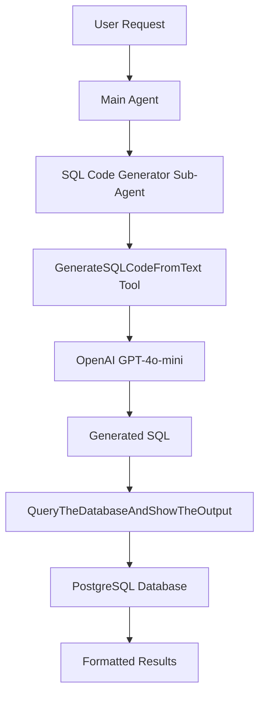

# Text-to-SQL-Supabase-Query-Agent
This project implements an intelligent Text-to-SQL Agent capable of converting natural language user requests into executable PostgreSQL queries. It utilizes OpenAI's GPT-4o-mini, LangGraph for agent orchestration, and connects securely to a Supabase database to fetch and display real-time analytics.

# Architecture

# Component Breakdown
**1. Main Coordinator Agent:** Orchestrates the workflow and delegates to sub-agents

**2. SQL Generator Sub-Agent:** Specialized agent for SQL code generation

**3. Text-to-SQL Tool:** Core tool that interfaces with OpenAI model

**4. Database Executor:** Safely executes SQL queries and formats results

**5. Safety Layer:** Validates and sanitizes SQL before execution
